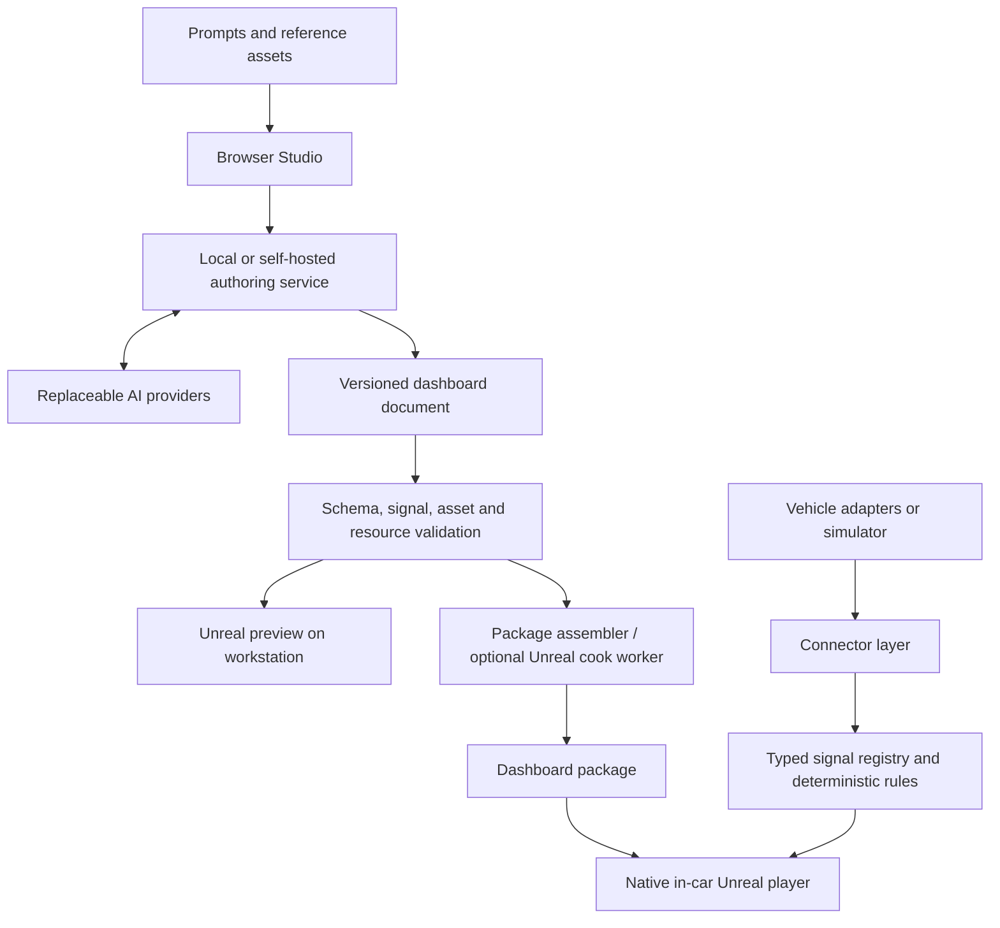

# UnRealDash project plan

Research snapshot: 2026-09-15. Status: proposal for discussion, not an implementation specification or performance claim. The existing project identifies the first vehicle as a 2009 VW Scirocco 2.0 TSI (CAWB/Bosch MED17.5), with an Adafruit Feather M4 CAN Express and a DUDU7 Android 13 deck (UIS7870). Start with the existing local TCP telemetry relay, then qualify direct USB CDC. These are repository findings, not a new live-device inspection. Bluetooth OBD-II and broad aftermarket ECU coverage are explicit product priorities. See [Pilot integration](PILOT-INTEGRATION.md) and [Research](RESEARCH.md).

## 1. Product definition

UnRealDash is an open, AI-authored, next-generation vehicle dashboard platform with a native Unreal player. Advanced animation, reactive materials, dimensional instruments, and real-time 3D are central product capabilities. People describe an instrument panel, supply references, connect signals, preview its behavior, and deploy it to their own display. The saved dashboard works locally without AI, an account, or the authoring machine. See [Creative direction](CREATIVE-DIRECTION.md) for the visual proposition and reference reconstruction workflow.

Three deliverables form the product:

| Deliverable | Purpose | Where it runs |
| --- | --- | --- |
| Studio | Prompting, reference uploads, signal setup, previews, revisions, deployment | Browser with a local or self-hosted authoring service |
| Player | Native graphics, telemetry, deterministic rules, interaction, package management | Android ARM64, Windows x64, Linux x86-64 |
| Open specification and SDK | Dashboard documents, signal contracts, connector manifests, fixtures, validation | Independent tools and community implementations |

The first release is a supplementary telemetry display. Replacing a factory instrument cluster introduces vehicle-specific startup, telltale, reliability, and regulatory requirements outside the initial release. Vehicle control and ECU programming are separate future scopes.

## 2. What using it looks like

1. Create a project and choose display size, aspect ratio, and a provisional device performance profile.
2. Drop in cluster photos, artwork, sketches, or written requirements. Mark references as inspiration or assets to include.
3. Describe the design: “Two analog dials, amber lighting, central gear indicator, oil pressure below RPM.”
4. Studio produces a dashboard with independently addressable components. A generated background may be raster artwork; live numbers, needles, labels, and warning indicators remain semantic elements.
5. Attach simulated signals or a real connector. Studio lists available signals, units, freshness, and unresolved bindings.
6. Refine with prompts, optionally selecting an element: “Make this dial larger; keep the other components unchanged.” Every edit creates a revision with a visual and semantic diff.
7. Run scenarios: idle, acceleration, high temperature, missing signal, disconnect, reconnect. Preview through the actual Unreal player before deployment.
8. Export a portable package or send it to a paired device. The device validates and stages the update, activates it while stationary, and retains the previous working package.

Studio should have a central preview; prompt and reference history at one side; signals, selected-component properties, and validation results at the other; and revision/scenario/deploy controls around the preview. Prompting is the primary workflow, with direct property edits and document export as escape hatches.

The in-car UI has the dashboard, a discreet connection-health indication, page selection, brightness/day-night settings, and a parked setup screen. It contains no AI conversation or development environment.

## 3. Architecture



**Proposed implementation:** C++ for the player and a small engine-independent signal/rule library; UMG/Slate for crisp instrument UI; an Unreal scene graph for 3D instruments, vehicles, materials, lighting, and effects; TypeScript for Studio and its local service. Use Python tooling where useful for offline CAN fixture generation and DBC validation. Avoid putting Python, Node, or an AI SDK in the car merely to support authoring. A thin player means eliminating authoring overhead and unused systems, not eliminating advanced graphics.

Logical separation does not require a separate process for everything. Start with built-in connectors behind a C++ interface. Desktop/Linux can later host adapters in a separate process. Android likely needs native platform integration in the app or an Android service; do not assume a desktop daemon layout transfers unchanged.

Pin an exact Unreal release and toolchain after the packaging spike. Current documentation describes UE 5.8; this is the candidate to evaluate, not a promise to follow every new engine release.

## 4. Dashboard document and packages

The editable source should be versioned JSON validated by JSON Schema, with stable component IDs. ZIP is a proposed interchange container, not an executable format.

```text
dashboard.udash
  manifest.json         schema version, package ID, revision, runtime compatibility
  dashboard.json        pages, components, constraints, bindings, rules
  signals.json          required signals, units, freshness and source mappings
  assets/               original/processed images and asset metadata
  scenarios/            optional synthetic demonstration recordings
  licenses/             asset attribution and applicable licenses
```

Define layout coordinates against a reference viewport, with explicit anchoring, scaling, clipping, and aspect-ratio policies. Do not stretch circular gauges into ellipses. Support per-aspect-ratio overrides rather than claiming one composition fits every display.

Initial primitives: text/numeric readout, image, line/shape, analog dial, arc/bar gauge, indicator, short history graph, container, and page switch. Each exposes a small validated property set. Provide day/night theme tokens, bounded transitions, formatting, ranges, and explicit missing-data rendering.

The first showcase additionally needs mesh instances, cameras, bounded material parameters, transform hierarchies, and timeline/state-machine primitives. Supported properties can bind to signals or deterministic transitions. Prebuilt effects expose adjustable parameters; novel shaders, meshes, and effect graphs use the cook/build path. This makes sophisticated prompt edits possible without requiring arbitrary shader compilation in the car.

There are three update classes:

| Change | Delivery path |
| --- | --- |
| Layout, supported rules, bindings, raster assets, existing component parameters | Data package; no player rebuild |
| New Unreal materials, advanced meshes, Blueprint content | Workstation cooking and engine/platform-compatible content bundle |
| New native connector or executable component | Rebuilt and tested application for each supported target |

Unreal's cooking pipeline is why arbitrary author-generated assets cannot all be treated as portable live edits. Runtime texture import exists, but image dimensions, decoded memory, upload time, and platform behavior still need validation. SVG and custom fonts should initially be converted or selected from supported assets during authoring rather than assumed to import universally at runtime. See research sources R2 and R3.

Bundle compatibility must include schema version, player capability version, target architecture, graphics profile, and engine/build identity for cooked content. Source documents stay portable even when a compiled asset bundle is not. Unknown components fail with a useful validation error.

## 5. Signals and connections

Adopt COVESA VSS names where they fit and support namespaced custom signals for aftermarket ECUs and DIY sensors. Pin the imported catalog version. VSS is a vocabulary; it does not supply vehicle CAN IDs or decode an unknown car. Keep mappings separate from layouts. See R6.

Each signal needs an ID, type, unit, value, source identity, sequence, receive timestamp, optional source timestamp, and quality state. At minimum distinguish valid, stale, unavailable, and invalid. Do not use zero as a stand-in for missing data. Select sources explicitly when more than one adapter provides a signal.

Normalize units once at the boundary. Keep acquisition rate separate from render rate: a 60 Hz needle animation does not create 60 Hz measurements. Interpolation is display-only, bounded, and disabled for discrete indicators; warning evaluation uses valid measured/derived values, not visual smoothing. Freshness uses a monotonic receive clock so clock changes do not silently revive old values.

Connection priorities (detailed in [Connector architecture](CONNECTORS.md)). Generic OBD-II is the first broadly useful product target; the custom Scirocco installation is an independent test rig, not the reference architecture users must reproduce:

1. Built-in deterministic simulator and recording/replay; no hardware required to contribute.
2. Generic OBD-II through common Bluetooth adapters: reusable ELM-compatible sessions, separate Classic/BLE transport profiles, supported-PID discovery, and measured polling rates. Reuse the session layer for compatible USB/Wi-Fi adapters later.
3. Aftermarket ECU integrations, with MegaSquirt, AEM and MoTeC as explicit early families. Track exact model, firmware/package, configured CAN stream and transport rather than claiming support for an entire brand. Broad worldwide coverage remains the long-term objective.
4. A documented WebSocket signal feed for custom gateways and workstation testing. Versioned JSON is sufficient initially; consider binary encoding only after measurement.
5. In parallel, use the Scirocco's decoded feed at local TCP port 35000 for real-world Android rendering and reliability tests, retaining existing firmware/logging. Direct Feather USB CDC is optional follow-on work, not a public-alpha prerequisite. Its decoded telemetry must not define the generic raw-CAN plugin contract.
6. Community compatibility adapters and importers for documented third-party transports and user-supplied signal definitions. Each needs a supported subset, fixtures, and license review; no compatibility is claimed before validation. See R7–R11 and R18–R20.

No manufacturer-specific mapping is invented from a signal name. AI may draft a mapping from supplied documentation, but byte order, bit layout, signedness, scaling, multiplexing, and sample frames require checks. OBD reads often require sending diagnostic requests; “telemetry only” means no vehicle-control operations, not necessarily a physically silent bus.

Derived signals and warnings use a constrained expression tree with whitelisted operations, units, hysteresis, debounce, and missing-input policies. No general-purpose script evaluation in dashboard files. Thresholds must have documented/user-supplied origins; an example threshold is not a universal engine limit.

## 6. AI authoring contract

The AI acts through tools such as inspect_project, list_signals, propose_patch, import_asset, validate_dashboard, render_preview, and run_scenario. It receives the selected components and relevant context rather than the entire project on every edit.

Separate a creative planning step from schema-constrained edits. Apply patches to a staged revision, check invariants, render it, and show the result. The AI can retry invalid proposals within a bounded attempt budget. Users accept a revision before it becomes a deployable release.

Use stable IDs and expected base revisions to prevent edits from targeting stale documents. Assert that unrelated components and bindings remain unchanged. Geometry, missing signals, unsupported components, and resource limits are machine checks; visual fidelity still needs human review.

Model adapters expose capabilities: image understanding, structured output, tool calls, context limits, and usage reporting. Vision-capable models interpret references; text-only models can edit a normalized design description. Local providers are supported when their capabilities are sufficient. Store model credentials on the authoring host, never in a deployed dashboard.

A prompt can configure existing connectors immediately. A request for a new driver or rendering primitive creates an implementation/build task whose output must pass review and tests before installation. AI-first does not require executing newly generated code in the player.

Protocol additions should normally use installable definition packs, with a portable sandboxed module SDK proposed for more complex parsers/session logic. This must be approachable with basic documentation and independent of Unreal development. The module runtime still requires a cross-platform feasibility spike. See [Plugin authoring experience](PLUGIN-EXPERIENCE.md); native drivers and new rendering primitives retain the platform-build path.

## 7. Preview and deployment

Start with a browser Studio controlling a locally installed Unreal preview process. Use the same rendering components and package loader as the player. Request rendered screenshots and telemetry scenarios through a narrow local API. Secure localhost pairing and reject unsolicited origins.

For remote browser use, Pixel Streaming can provide an interactive Unreal preview running on a workstation or GPU server. It does not eliminate the rendering machine; remote preview brings GPU/session and network costs. Add it after local authoring works. A lightweight browser mock preview may be useful later, but must be labeled approximate. See R5.

The vehicle renders locally and does not depend on Pixel Streaming. Support file import before network deployment. Later, use explicit device pairing and authenticated transfer. Stage and validate updates before switching an active-package pointer atomically. Keep a known-good package and built-in fallback screen. A corrupt package must not replace the active one; repeated failed launches should select the previous package.

Publisher signatures are useful for provenance, but owners must be able to trust their own signing keys and install community packages. Cryptographic validity does not certify correctness. Bound archive expansion, asset sizes, expression complexity, and path handling before activation.

## 8. Performance and device strategy

Design the scene model for advanced 3D and effects from the start, with scalable quality profiles. A mobile profile can retain dimensional geometry, animated materials, and coordinated motion using simpler lighting, fewer particles, and lower effect resolution. Desktop profiles can add richer effects when measured budgets permit. Do not require Lumen, Nanite, or ray tracing for the product's identity. Use event-driven UI updates, cache static content, and limit per-frame work to components that animate. Profile CPU/GPU costs and translucent overdraw. UMG, Niagara, and mobile feature guidance inform this approach but establish no application-specific performance guarantee. See R4, R15, and R16.

The following are proposed engineering gates, not measured results or minimum hardware specifications:

| Metric | Initial test goal |
| --- | --- |
| Standard dashboard | 60 Hz at 1280×720, 12 active instruments plus indicators |
| Showcase dashboard | Same 60 Hz target on a nominated reference device with layered 3D dials, material effects, and coordinated transitions; publish exact effect settings |
| Frame time | p95 at or below 16.7 ms; record p99 and missed frames separately |
| Receive-to-present latency | p95 below 100 ms; exclude adapter polling delay and report that separately |
| Cold application launch | First usable dashboard within 5 seconds; measure OS boot separately |
| Player memory | Aim below 750 MB resident/PSS on the standard profile; report texture memory separately |
| Steady operation | 60-minute thermal test plus 8-hour desktop soak; no monotonic memory growth |
| Loss of telemetry | Explicit stale state within the configured signal deadline |
| Update failure | Previous valid package loads after corruption or interrupted activation |

Use external/high-speed observation for end-to-end display latency when possible; software timestamps alone do not measure panel scanout. Record build, device, resolution, power mode, temperature, and sample size with every benchmark.

Develop on Windows, package Linux early, and test on one Android ARM64 device during the first spike. Published Linux desktop support does not establish Raspberry Pi or arbitrary ARM Linux compatibility. Cheap head units, simultaneous charging/USB data, screen brightness, boot behavior, and suspend/resume are device qualification work. Engine platform requirements are only a starting point. See R11–R13.

## 9. Community and licensing

Publish original source, schema, example dashboards, protocol docs, contributor instructions, and reproducible build steps. Keep the player and format usable without a mandatory registry, account, or model provider. Use optional registries that can be mirrored and local file installation that always works.

Propose MIT for original project code and an explicit permissive license for original example assets; final license selection is a project-owner decision. Engine code is governed separately by Epic. Do not represent the entire Unreal-based stack as unrestricted open-source software.

Before distributing an authoring tool or cooked-content service, resolve the applicable Engine Tools rules and distribution/seat obligations for the exact architecture. An independent JSON authoring frontend is a useful design boundary, not proof that all licensing questions disappear. Review plugin licenses individually. Epic's HMI template is currently request-gated and must not be a required community dependency. See R1 and R14.

## 10. Roadmap with decision gates

| Stage | Concrete output | Exit condition |
| --- | --- | --- |
| 0. Feasibility | Packaged player, JSON-defined dial/readout, image loading, simulator, plus a separate 3D/material/motion showcase | Works on Windows and representative Android; Linux packages; report shows both baseline cost and achievable visual quality |
| 1. Runtime foundation | Versioned schema, component library, signal quality, rules, replay, package validation | Same fixture behaves consistently across targets; invalid/stale data and corrupt updates handled correctly |
| 2. AI vertical slice | Reference reconstruction, prompt-driven 3D/material/motion edits, staged patches, actual Unreal preview, revision history | Ten creation/edit/reconstruction tasks work with bounded retries; unrelated properties preserved; no rebuild for edits within existing capabilities |
| 3. Vehicle pilot and connector alpha | Generic Bluetooth OBD-II reference path; versioned MegaSquirt/AEM/MoTeC integration backlog and decoder fixtures as documentation permits; custom test-rig runs | OBD-II verified independently on a representative adapter/vehicle; aftermarket statuses recorded per model; custom rig supplies additional reliability evidence |
| 4. Community alpha | SDK, example packages, platform builds, contribution docs, optional registry interface | Another person can build the player, author a dashboard, and add a documented connector without maintainer-only services |

Do not give a calendar estimate until Stage 0 establishes engine packaging, device availability, and build turnaround. AI task success should record first-pass rate, retries, latency, and model spend. Count accepted valid results rather than attractive screenshots alone.

Deferred scope: unrestricted generated runtime code, full navigation, media integration, CarPlay/Android Auto, broad ECU tuning/control, paid marketplace, production cloud GPU fleet, arbitrary ARM Linux support, and certified primary-cluster replacement. These remain possible extensions, not first-release dependencies.

## 11. Proposed repository layout

```text
apps/studio/                  browser authoring interface
apps/authoring-service/       projects, AI adapters, preview/build jobs
runtime/UnRealDash/           Unreal project and platform integration
packages/dashboard-spec/     schema, migrations, example documents
packages/signal-core/        engine-independent C++ data and rule logic
connectors/                  manifests, interfaces, supported integrations
tools/simulator/              deterministic feeds and recording/replay
examples/                    original dashboard designs
tests/fixtures/               synthetic signals and permitted CAN samples
docs/                         architecture, decisions, build and user guides
```

This is a proposed layout; no empty scaffolding or application dependencies have been created. Keep engine-derived binaries, model credentials, real driving recordings, and third-party assets with restricted redistribution out of the source repository.

## 12. Decisions still needed

- Confirm installed pilot firmware/schema revisions and USB descriptors against the inspected project.
- Measure the DUDU7's available memory, GPU/driver capabilities, usable viewport and wake behavior; select Bluetooth test adapters.
- Whether the first real installation is supplementary or intended eventually to replace a cluster.
- Which signature showcase to prioritize within the agreed advanced-graphics direction: dimensional instruments, reactive vehicle visualization, or spatial mode transitions.
- License choice for original code and assets.

Until these are resolved, proceed with synthetic telemetry, a simple control dashboard plus an expressive 3D showcase, local authoring, and architecture that accommodates direct adapters and external gateways. Reference reconstruction and advanced visual authoring are core scope, not deferred differentiators.
